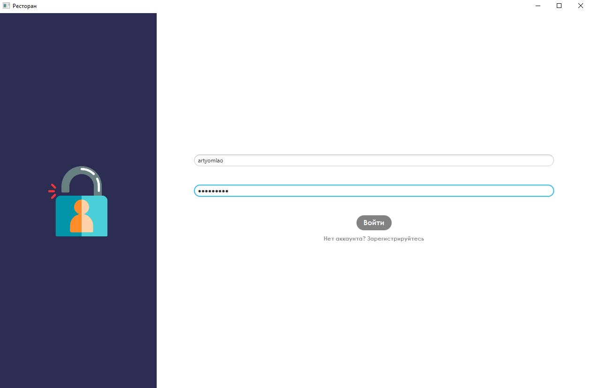
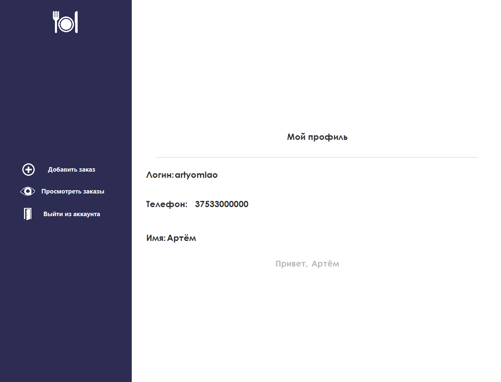
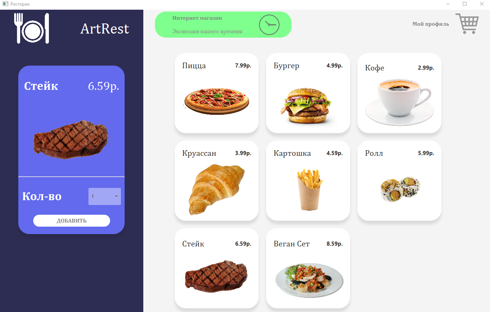
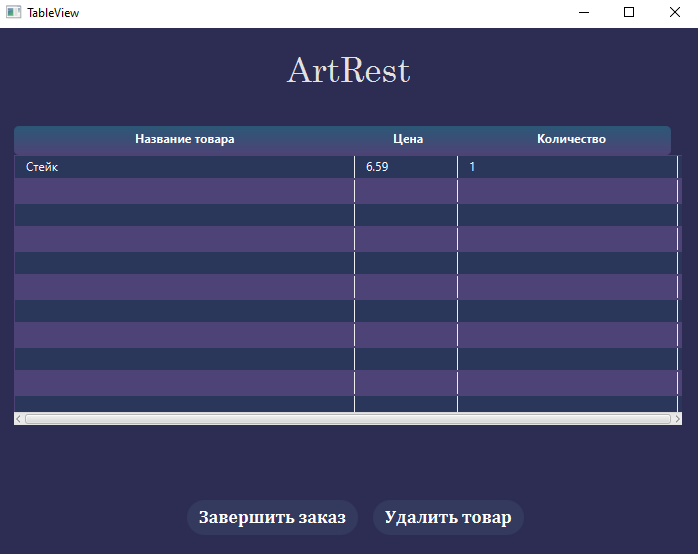

## Introduction
I'm here to represent my JavaFX Client-Server(based on sockets) project integrated with Hibernate
## Launch
To launch this project you just need to clone it and generate DB tables
## Demonstration
#### Authorisation
After launching our program we connect to server that will process data.
And then we will move to authorisation window. If our account doesn't exist, we need to press the hyperlink below to sign up new profile.

#### Menu Account
Next we see profile view

#### Restaurant Menu
If at previous window we push button with adding order, program shows that one. Menu where we can get some food.
Tbh that design of this terrific window wasn't mine)

#### Order View

